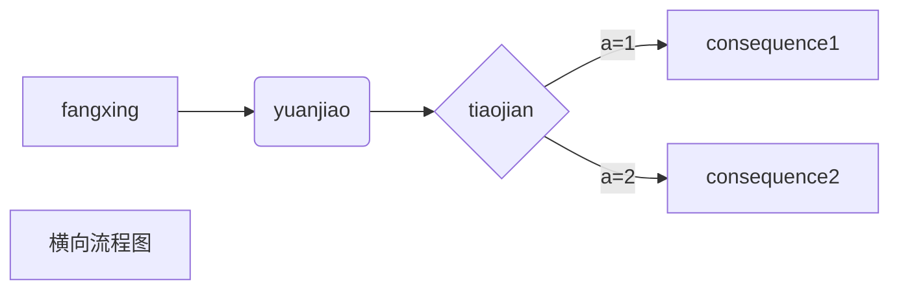
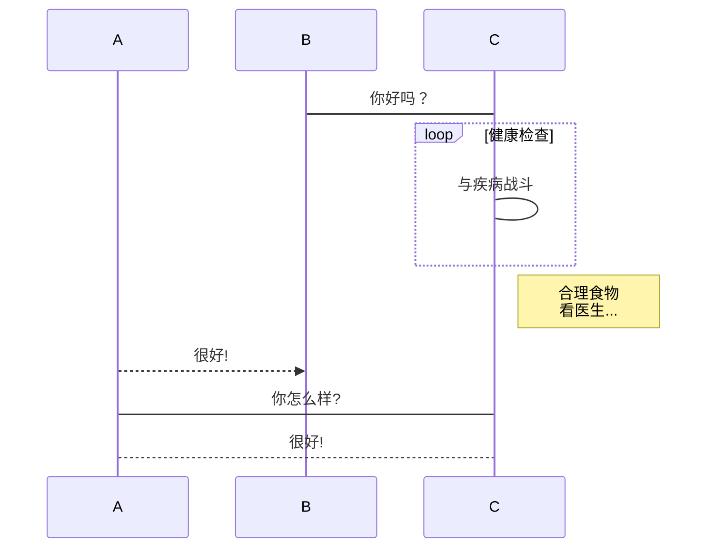

## 这是二级标题

#### 这是四级标题

## 代码样例

```python
'''
    这是样例
'''
while(True):
	print('Hello world!')
```

## 公式样例

$$
\begin{align*}
G_{\mathrm{RC}}(f)= \begin{cases}T, & |f| \leqslant \frac{1-r}{2 T} \\ 
\frac{T}{2}\{1+\cos \frac{\pi T}{r}\left(|f|-\frac{1-r}{2 T}\right) \}, & \frac{1-r}{2 T}<|f| \leqslant \frac{1+r}{2 T} \\
\\  0, & |f|>\frac{1+r}{2 T}\end{cases}
\end{align*}
$$

$$
\begin{align*}
  & \phi(x,y) = \phi \left(\sum_{i=1}^n x_ie_i, \sum_{j=1}^n y_je_j \right)
  = \sum_{i=1}^n \sum_{j=1}^n x_i y_j \phi(e_i, e_j) = \\
  & (x_1, \ldots, x_n) \left( \begin{array}{ccc}
      \phi(e_1, e_1) & \cdots & \phi(e_1, e_n) \\
      \vdots & \ddots & \vdots \\
      \phi(e_n, e_1) & \cdots & \phi(e_n, e_n)
    \end{array} \right)
  \left( \begin{array}{c}
      y_1 \\
      \vdots \\
      y_n
    \end{array} \right)
\end{align*}
$$

## 一些流程图

#### mermaid






## 图片样例


## 文字样例

这是一段废话，<u>你可以看看</u>，**当然也可以选择不看**，*无论看或不看*，==对这段废话来说，基本没什么影响==。~那么你是选择看还是不看呢~，^问问你自己吧^，<!--不出意外的话就要出意外了-->。

> 讲了这么多，你是否感觉听君一席话，如听一席话呢？

## 表格样例

| 0    |  1   |
| ---- | :--: |
| 2    |  3   |

[回到开头](##这是二级标题)
